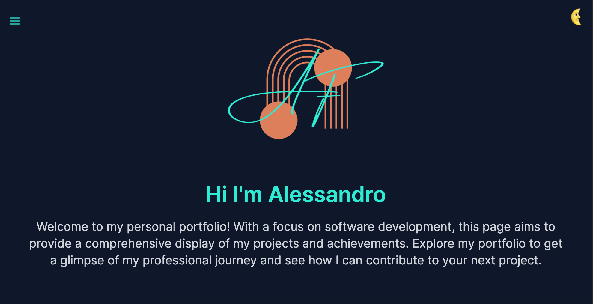
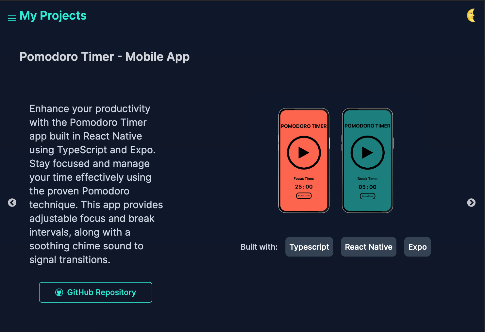
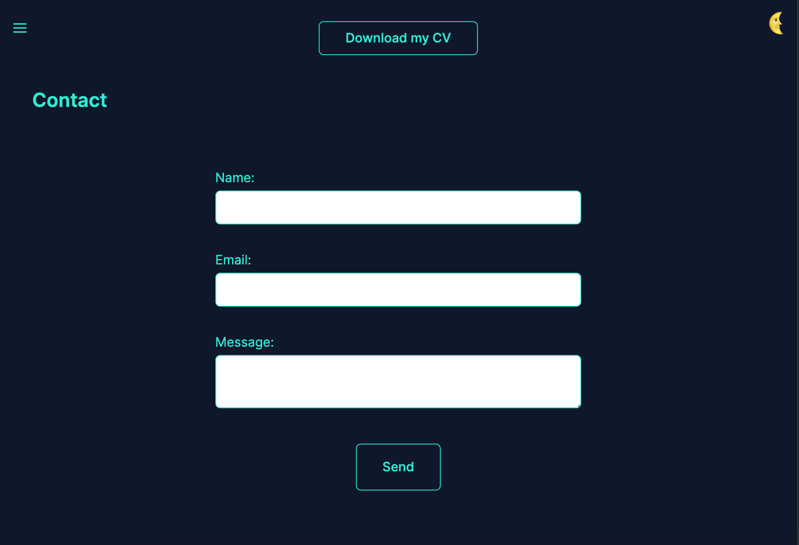

# Alessandro's Personal Portfolio:

**⚠️ THIS IS A WORK IN PROGRESS - THIS PORTFOLIO PROJECT IS IN CONTINUOUS DEVELOPMENT ⚠️**

<div style="display: flex; justify-content: center; margin-bottom: 20px;">
    
    </br>
</div>

Welcome to my portfolio! This is a showcase of my work, skills, and experience in software development. I graduated from [Northcoders](https://www.northcoders.com/), an intensive full-stack coding bootcamp, where I gained a solid foundation in web development.

Direct link --> https://alessandrofrondini.netlify.app/

## Table of Contents

- [About](#about)
- [Instructions](#instructions)
- [Contact](#contact)


## About
I built this portfolio using [React](https://reactjs.org/) and [Vite.js](https://vitejs.dev/), a fast build tool for modern web development. The styling is done with [Tailwind CSS](https://tailwindcss.com/), Its utility-based approach provides a wide range of pre-defined classes that I can apply directly to React tags, saving time and effort. 
The combination of those enabled me to create a fully responsive and visually appealing web page.

## Screenshots
<div style="justify-content: center;">
  
  
  </br>
  
  
</div>


## Instructions

To correctly display the portfolio content in your own code editor, please follow these steps:

Run the following command to install the necessary dependencies:
```console
npm install
```

After the installation is complete, run the following command to start the development server:
```console
npm run dev
```

Additionally, make sure to install the required dependencies by running the following command:
```console
npm install -D tailwindcss postcss autoprefixer
```
Finally, initialize Tailwind CSS configuration by running the following command:
```console
npx tailwind init -p
```

By following these instructions, you will be able to properly display and interact with the portfolio content in your own code editor.


## Contact

Thank you for visiting my portfolio! I hope you find it informative and engaging. If you have any questions or would like to discuss potential collaborations or opportunities, feel free to send me an [Email](mailto:alessandrofrondini@gmail.com) or drop me a message on [LinkedIn](https://www.linkedin.com/in/alefrondini/) !

I'm looking forward to connecting with you!

## Acknowledgements

- Skills icons provided by <a href='https://devicon.dev/' target='_blank'>Devicon</a>
- This page was inspired by the desire to improve myself and to keep track of my progress in the never ending coding journey.